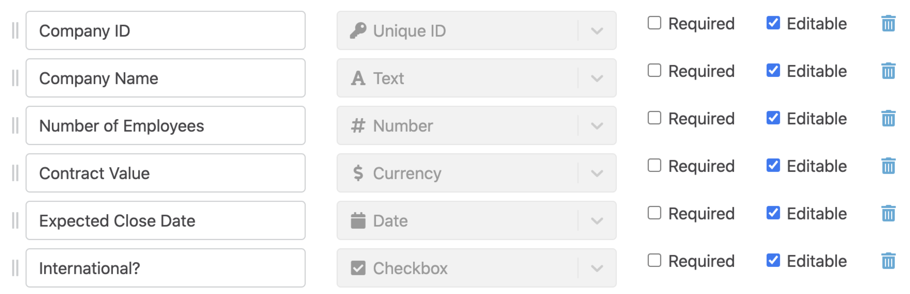

# Introduction

The Flowdash API makes it easy to seamlessly add tasks to Flowdash and to wire up actions within Flowdash back to your application. These docs will walk through the process of setting up an integration.

For the examples below, we'll use a flow with the following fields configured:

