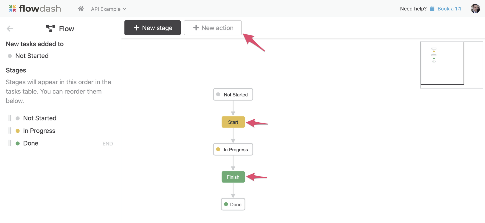
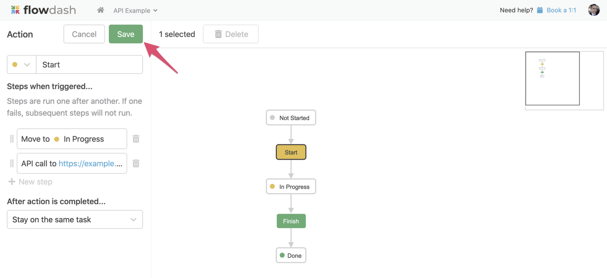

# Creating a new action

While the Task API makes it easy to get data into Flowdash, Actions make it easy to get data out of Flowdash and back into your application via a RESTful API. All you need to do is specify a URL to call and any relevant headers, and Flowdash will call your API every time a user performs the specified action.

1. First, open the Flow Builder:

2. Next, create a new action, or select an existing action from the canvas. In the screenshot below, **Start** and **Finish** are existing actions:

3. In the left sidebar, click the **+ New Step** button and select **API Call** from the dropdown:

4. In the modal that opens, you can specify the URL of your API endpoint as well as any additional headers (for example, authorization headers):

5. Once you're done, click **Apply**, then click **Save** in the left sidebar to commit your changes.

