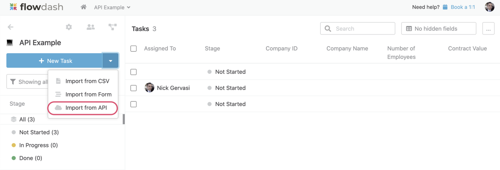
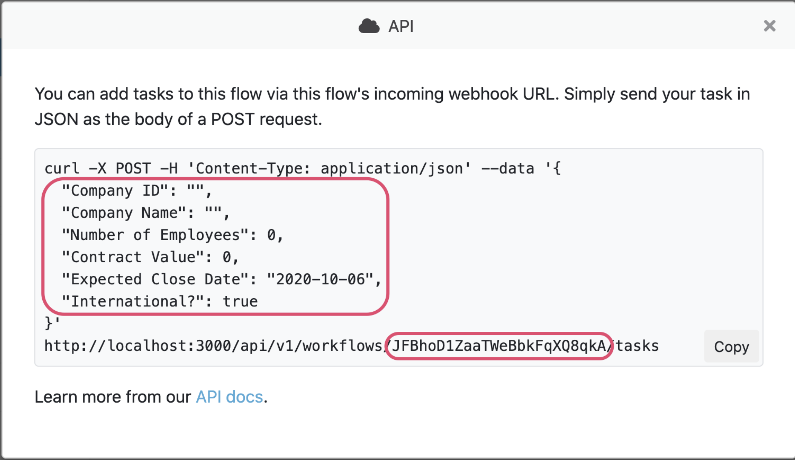

# Creating a new task
1. Log into Flowdash and open the workflow you'd like to add tasks to.
2. Click the arrow next to the **New Task** button, then click the **Import from API** option in the dropdown.



3. A modal will open with an example cURL request for creating a workflow. The example includes a token that uniquely identifies the workflow (keep this secure) as well as a sample payload that reflects your workflow's schema.



In addition to the fields above you can also set the Stage and Assigned To. The Stage should be a string matching any of the stages defined on the workflow and Assigned To should be the email address of the user you'd like to assign the task to (or null if you'd like the task to be undefined). For example, if I'd like the mark the task as In Progress and assign it to user@example.com, I should include the following attributes in my request payload:

```json
"Stage": "In Progress",
"Assigned To": "user@example.com"
```

4. Adapt the example to your language and framework, change the sample data to real data, and you're ready to go! Here's an example for NodeJS using the Request library:

```javascript
var request = require('request');
var options = {
  'method': 'POST',
  'url': 'https://app.flowdash.com/api/v1/workflows/RtJCU5EC5gz8S6LAc7anxEP4/tasks',
  'headers': {
    'Content-Type': 'application/json'
  },
  body: JSON.stringify({
    "Company ID":"42",
    "Company Name":"Acme Corp",
    "Number of Employees":10,
    "Contract Value":10000,
    "Expected Close Date":"2020-01-31",
    "International?":false,
    "Stage":"In Progress",
    "Assigned To":"user@example.com"
  })
};
request(options, function (error, response) { 
  if (error) throw new Error(error);
  console.log(response.body);
});
```

In addition to the fields you've defined, you can also set the built-in Stage and Assigned To fields.

## Response Codes and Body

In addition to the fields you've defined, you can also set the built-in Stage and Assigned To fields.

```json
{
    "Stage": "In Progress",
    "Assigned To": "user@example.com",
    "Task URL": "https://app.flowdash.com/workflows/2ylSaZ/tasks/ooCwnZ",
    "Company ID": "42",
    "Company Name": "Acme Corp",
    "Number of Employees": "10",
    "Contract Value": "10000",
    "International?": false,
    "Expected Close Date": "2020-01-31"
}
```

A 422 response indicates that invalid data was provided in the request body. The response body will indicate specifically which data was invalid (dates should be in YYYY-MM-DD format). For example, if we try to create a task with an invalid Expected Close Date, we would get a 422 response body with the following body:

```json
{
    "errors": {
        "Expected Close Date": [
            "is invalid"
        ]
    }
}
```

## A note on Unique ID's

Flowdash allows you to optionally designate one field in your workflow as a Unique ID. If a Unique ID field is defined, Flowdash will ensure that no two tasks are created with the same value for that field. In the example above, we've defined Company ID as a unique ID.
